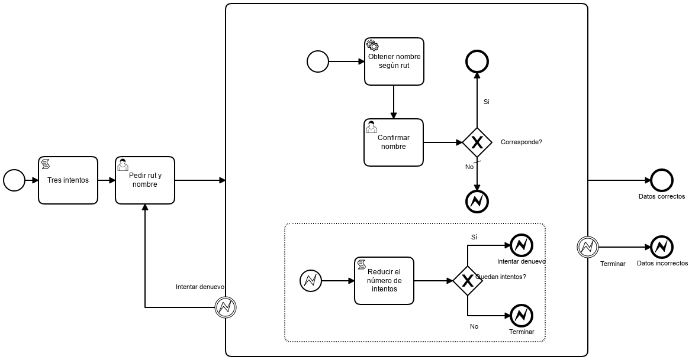

# Check Rut Improved Example

Información sobre el API que se utiliza en este ejemplo [LINK](https://rutify.cl/api)

|   Nr. | Tópico                                          | Actividad                                                                                                                                                                                                                                                                                                                                                                                                                                                                                                                                                                                                                               |
| :---: | :---                                            | :---                                                                                                                                                                                                                                                                                                                                                                                                                                                                                                                                                                                                                                    |
|     1 | **StartEvent**                    | 1. En la pestaña 'General', configura el parámetro **Initiator** = 'starter' 'starter' es una variable en la que almacenaremos el ID de la persona que inicia el flujo.                                                                                                                                                                                                                                                                                                                                                                                                                |
|     2 | **'Pedir rut y nombre' User Task**              | 1. En la pestaña 'General', configura el parámetro **Assignee** = '${starter}'. 2. En la pestaña 'Forms' agrega una variable del siguiente modo: 2a. **ID** = 'nombre', **Type** = 'string', **Label** = 'Nombre'.  2a. **ID** = 'rut', **Type** = 'string', **Label** = 'RUT'.                                                                                                                                                                                                                                                                                                                                                |
|     3 | **'Confirmar nombre' User Task**                | 1. En la pestaña 'General', configura el parámetro **Assignee** = '${starter}'. 2. En la pestaña 'Forms' agrega una variable del siguiente modo: 2a. **ID** = 'nombre', **Type** = 'string', **Label** = 'Nombre'.  2a. **ID** = 'nombreObtenido', **Type** = 'string', **Label** = 'Nombre según RUT'.  2a. **ID** = 'corresponde', **Type** = 'boolean', **Label** = 'Corresponde?'.                                                                                                                                                                                                                                      |
|     4 | **'Obtener nombre según rut' Service Task**     | 1. Configura el parámetro 'Implementation' = 'Connector'.   2. Muévete a la pestaña **Connector**. Configura el parámetro **Connector Id** = 'http-connector'.  3. Agrega los siguientes **Input Parameter**:  3a. **Name** = 'method'. **Type** = 'Text'. **Value** = 'GET'.   3b. **Name** = 'url'. **Type** = 'Script'. **Script Format** = 'freemarker'. **Script Type** = 'Inline Script'. **Script Format** = 'https://api.rutify.cl/rut/${rut}'. 4. Agrega los siguientes **Output Parameter**:  4a. **Name** = 'nombreObtenido'. **Type** = 'Text'. **Value** = 'S(response).prop('nombre').value().toString()'. |
|     5 | **'Corresponde? Si' Sequence Flow**             | 1. Configura el parámetro 'Condition Type' = 'Expression' and 'Expression' = '#{corresponde}'.                                                                                                                                                                                                                                                                                                                                                                                                                                                                                                                                          |
|     6 | **'Corresponde? No' Sequence Flow**             | 1. Usando la herramienta de ícono cambia el tipo de flujo a 'Default Flow'.                                                                                                                                                                                                                                                                                                                                                                                                                                                                                                                                                             |
|     7 | **'Terminar' Error Termination Event**          | 1. Crear un nuevo error con los siguientes parámetros:   1a. **Error Name** = 'Intentos agotados' y **Error Code** = 'Intentos agotados'.                                                                                                                                                                                                                                                                                                                                                                                                                                                                                            |
|     8 | **'Terminar' Error Intermediate Event**         | 1. Seleccionar el error 'Intentos agotados' desde el menú desplegable.                                                                                                                                                                                                                                                                                                                                                                                                                                                                                                                                                                  |
|     9 | **'Intentar denuevo' Error Termination Event**  | 1. Crear un nuevo error con los siguientes parámetros:   1a. **Error Name** = 'Nombre no corresponde'   1b. **Error Code** = 'Nombre no corresponde'.                                                                                                                                                                                                                                                                                                                                                                                                                                                                             |
|    10 | **'Intentar denuevo' Error Intermediate Event** | 1. Seleccionar el error 'Nombre no corresponde' desde el menú desplegable.                                                                                                                                                                                                                                                                                                                                                                                                                                                                                                                                                              |
|    11 | **'Tres intentos' Script Task**                 | 1. En la pestaña 'General', configurar los siguientes parámetros:   1a. **Script Format** = 'groovy'   1b. **Script Type** = 'Inline Script'   1c. **Script** = 'execution.setVariable("intentos", 3)'                                                                                                                                                                                                                                                                                                                                                                                                                         |
|    12 | **'Reducir el número de intentos' Script Task** | 1. En la pestaña 'General', configurar los siguientes parámetros:   1a. **Script Format** = 'groovy'   1b. **Script Type** = 'Inline Script'   1c. **Script** = 'def n = execution.getVariable("intentos"); n -= 1; execution.setVariable("intentos", n)'                                                                                                                                                                                                                                                                                                                                                                      |
|    13 | **'Quedan intentos? Sí' Sequence Flow**         | 1. Configurar el parámetro 'Condition Type' = 'Expression' y 'Expression' = '#{intentos > 0}'.                                                                                                                                                                                                                                                                                                                                                                                                                                                                                                                                          |
|    14 | **'Quedan intentos? No' Sequence Flow**         | 1. Usando la herramienta de ícono cambia el tipo de flujo a 'Default Flow'                                                                                                                                                                                                                                                                                                                                                                                                                                                                                                                                                              |
