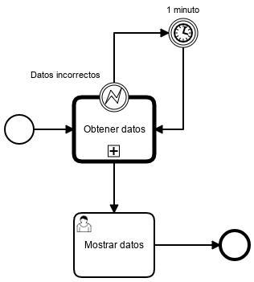

# Check Rut Improved Example

|   Nr. | Tópico                                       | Actividad                                                                                                                                                                                             |
| :---: | :---                                         | :---                                                                                                                                                                                                  |
|     1 | **'Mostrar datos' User Task**                | 1. En la pestaña 'Forms' agrega una variable del siguiente modo: 1a. **ID** = 'nombre', **Type** = 'string', **Label** = 'Nombre'.  1b. **ID** = 'rut', **Type** = 'string', **Label** = 'RUT'. |
|     2 | **'Datos incorrectos' Error Boundary Event** | 1. Dejar como está.                                                                                                                                                                                   |
|     3 | **'1 minutos' Timer Intermediate Event**     | 1. Seleccionar los siguientes parámetros:   1a. **Timer Definition Type** = 'Duration'.   1b. **Timer Definition** = 'PT1M'.                                                                    |
|     4 | **'Obtener datos' Call Activity**            | 1. Seleccionar los siguientes parámetros:   1a. **Call Activity Type** = 'BPMN'.   1b. **Called Element** = 'CheckRut'.   2. En la pestaña 'Variables' agregar el siguiente **Out Mapping**:   2a. **Type** = 'All'. |
