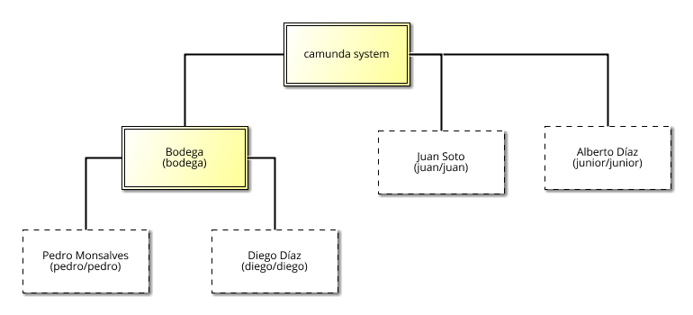

# Creación de usuarios y grupos
Para la creación de todos los usuarios siguientes, se debe estar "loggeado" con una cuenta de administrador. Implementaremos la organización de la siguiente figura:

## Tabla usuarios

| User ID | Password | Firstname | Lastname  |
| :---:   | :---:    | :---:     | :---:     |
| juan    | juan     | Juan      | Soto      |
| pedro   | pedro    | Pedro     | Monsalves |
| diego   | diego    | Diego     | Díaz      |
| junior  | junior   | Alberto   | Díaz      |

## Tabla autorizaciones
|               | Application |             | Process Definition    |             | Process Instance |             |
| :---:         | :---:       | :---:       | :---:                 | :---:       | :---:            | :---:       |
| User/Group ID | Permissions | Resource ID | Permissions           | Resource ID | Permissions      | Resource ID |
| bodega        | ACCESS      | tasklist    | -                     | -           | -                | -           |
| juan          | ALL         | tasklist    | READ, CREATE_INSTANCE | *           | CREATE           | *           |
| junior        | ACCESS      | tasklist    | -                     | -           | -                | -           |

| a | b |
|---|---|
| > | b |
| a ||

## Paso-a-paso
### Crear Usuario
- Ingresar al "Admin".
- Click en "Users".
- Click en "Add user"
- Llenar los siguientes atributos:
  - "User ID" = "juan"
  - "Password" = "juan"
  - "Firstname" = "Juan"
  - "Lastname" = "Soto"
- Click en "Create new user"
### Autorizaciones
- Ingresar al "Admin".
- Click en "Authorizations".

#### Application
- Click en "Create new authorization".
- Llenar los siguientes atributos:
  - "User / Group ID" = "juan"
  - "Permissions" = "ALL"
  - "Resource ID" = "tasklist"
  - Click en el "visto".
#### Process Definition
- Click en "Create new authorization".
- Llenar los siguientes atributos:
  - "User / Group ID" = "juan"
  - "Permissions" = "READ, CREATE_INSTANCE"
  - "Resource ID" = "*"
  - Click en el "visto".
#### Process Instance
- Click en "Create new authorization".
- Llenar los siguientes atributos:
  - "User / Group ID" = "juan"
  - "Permissions" = "CREATE"
  - "Resource ID" = "*"
  - Click en el "visto".
  
## Grupo bodega
### Crear grupo
- Ingresar al "Admin".
- Click en "Groups".
- Click en "Create new group".
- Llenar los siguientes atributos:
  - "Group ID" = "bodega"
  - "Group name" = "Bodega"
- Click en "Create new group".

### Autorizaciones
- Ingresar al "Admin".
- Click en "Authorizations".

#### Application
- Click en "Create new authorization".
- Llenar los siguientes atributos:
  - "User / Group ID" = "bodega"
  - "Permissions" = "ACCESS"
  - "Resource ID" = "tasklist"
  - Click en el "visto".

### Crear Usuarios
- Ingresar al "Admin".
- Click en "Users".
- Click en "Add user"
- Llenar los siguientes atributos:
  - "User ID" = "pedro"
  - "Password" = "pedro"
  - "Firstname" = "Pedro"
  - "Lastname" = "Monsalves"
- Click en "Create new user".
- Click en "Add user".
- Llenar los siguientes atributos:
  - "User ID" = "diego"
  - "Password" = "diego"
  - "Firstname" = "Diego"
  - "Lastname" = "Díaz"
- Click en "Create new user.
### Agregar los usuarios al grupo
- Ingresar al "Admin".
- Click en "Users".
- Click en "pedro".
- Click en "Groups".
- Click en "Add to a group".
- Seleccionar "bodega".
- Repetir con "diego".
## Agregar usuario "junior"
- Ingresar al "Admin".
- Click en "Users".
- Click en "Add user"
- Llenar los siguientes atributos:
  - "User ID" = "junior"
  - "Password" = "junior"
  - "Firstname" = "Alberto"
  - "Lastname" = "Díaz"
- Click en "Create new user"
### Agregar autorización
- Ingresar al "Admin".
- Click en "Authorizations".

#### Application
- Click en "Create new authorization".
- Llenar los siguientes atributos:
  - "User / Group ID" = "junior"
  - "Permissions" = "ACCESS"
  - "Resource ID" = "tasklist"
  - Click en el "visto".