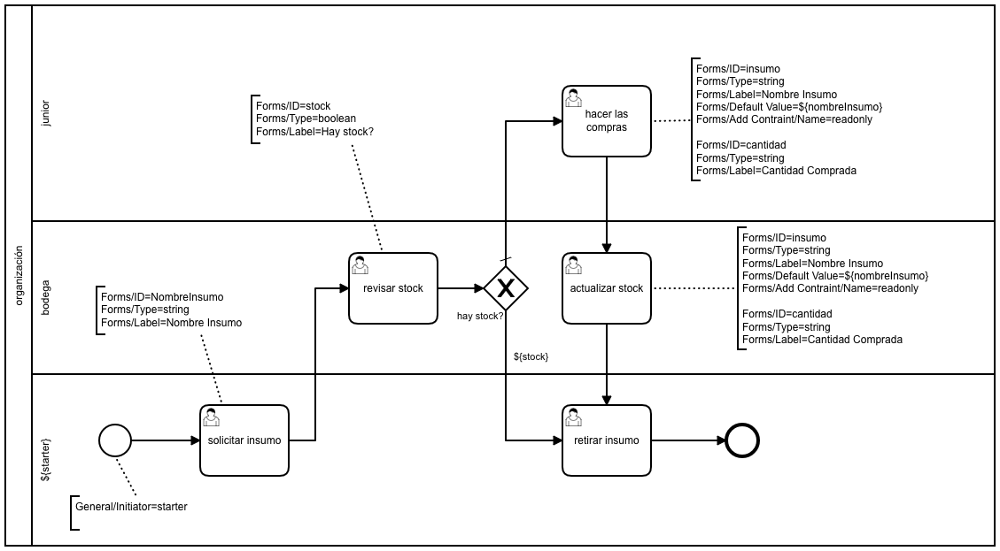

# Solicitar Insumo

|   Nr. | Tópico                            | Actividad                                                                                                                                                                                                                                                                                                                                                                                                                                                                                   |
| :---: | :---                              | :---                                                                                                                                                                                                                                                                                                                                                                                                                                                                                        |
|     1 | **StartEvent**                    | 1. En la pestaña 'General', configura el parámetro **Initiator** = 'starter' 'starter' es una variable en la que almacenaremos el ID de la persona que inicia el flujo.                                                                                                                                                                                                                                                                                                                                                                                                                |
|     2 | **'Solicitar Insumo' User Task**  | 1 En la pestaña 'General', configura el parámetro **Assignee** = '${starter}'. 2. En la pestaña 'Forms' agrega una variable del siguiente modo: 2a. **ID** = 'nombreInsumo', **Type** = 'string', **Label** = 'Nombre Insumo'.                                                                                                                                                                                                                                                       |
|     3 | **'Revisar stock' User Task**     | 1. En la pestaña 'General', configura el parámetro **Candidate Groups** = 'bodega'. 2. En la pestaña 'Forms', agrega una variable del siguiente modo: 2a. **ID** = 'stock', **Type** = 'boolean', **Label** = 'Hay stock?'.                                                                                                                                                                                                                                                           |
|     4 | **'Hacer las compras' User Task** | 1. En la pestaña 'General', configura el parámetro **Assignee** = 'junior'. 2. En la pestaña 'Forms', agrega dos variables del siguiente modo: 2a. **ID** = 'insumo', **Type** = 'string', **Label** = 'Nombre Insumo', **Default Value** = '${nombreInsumo}', **Add Constraint** -> **Name** = 'readonly'. 2b. **ID** = 'cantidad', **Type** = 'string', **Label** = 'Cantidad Comprada'                                                                                          |
|     5 | **'Actualizar stock' User Task**  | 1. En la pestaña 'General', configura el parámetro **Candidate Groups** = 'bodega'. 2. En la pestaña 'Forms', agrega dos variables del siguiente modo: 2a. **ID** = 'insumo', **Type** = 'string', **Label** = 'Nombre Insumo', **Default Value** = '${nombreInsumo}', **Add Constraint** -> **Name** = 'readonly'. 2b. **ID** = 'cantidad', **Type** = 'string', **Label** = 'Cantidad Comprada', **Default Value** = '${cantidad}', **Add Constraint** -> **Name** = 'readonly'. |
|     6 | **'Retirar Insumo' User Task**    | 1. En la pestaña 'General', configura el parámetro **Assignee** = '${starter}'.                                                                                                                                                                                                                                                                                                                                                                                                             |
|     7 | **'Hay stock? sí' flujo**         | 1. Configura el parámetro 'Condition Type' = 'Expression' y 'Expression' = '${stock}'.                                                                                                                                                                                                                                                                                                                                                                                                      |
|     8 | **'Hay stock? no' flujo**         | 1. Usando el ícono de herramienta, cambia el tipo a 'Default Flow'.                                                                                                                                                                                                                                                                                                                                                                                                                         |
|     9 | **Modelo**         | 1. Sin seleccionar ningún objeto, asegure que el 'General' esté seleccionada la opción 'Executable'.                                                                                                                                                                                                                                                                                                                                                                                                                         |
