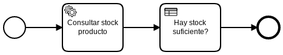

# Consultar Stock 2

Documentación sobre cómo iniciar un proceso desde el API [Link](https://docs.camunda.org/manual/7.9/reference/rest/process-definition/post-start-process-instance/)

Para iniciar el proceso es necesario hacer una llamada al endpoint http://localhost:8080/engine-rest/process-definition/key/ConsultaStock2/start

|   Nr. | Tópico                                         | Actividad                                                                                                                                                                                                                                                                                                                                                                                                                                                                                                                                                                                                                                                                                                                                                                                                                                                                                                         |
| :---: | :---                                           | :---                                                                                                                                                                                                                                                                                                                                                                                                                                                                                                                                                                                                                                                                                                                                                                                                                                                                                                              |
|     1 | **'Consultar stock producto' Service Task**    | 1. Configura el parámetro 'Implementation' = 'Connector'.   2. Muévete a la pestaña **Connector**. Configura el parámetro **Connector Id** = 'http-connector'.  3. Agrega los siguientes **Input Parameter**:  3a. **Name** = 'method'. **Type** = 'Text'. **Value** = 'GET'.   3b. **Name** = 'url'. **Type** = 'Script'. **Script Format** = 'freemarker'. **Script Type** = 'Inline Script'. **Script** = 'http://localhost:8000/stock/${codigo}'. 4. Agrega los siguientes **Output Parameter**:  4a. **Name** = 'nombre'. **Type** = 'Script'.**Script Type** = 'Inline Script'.**Script Format** = 'javascript' **Script** = 'S(response).prop('nombre').value()'.    4a. **Name** = 'tipo'. **Type** = 'Script'.**Script Type** = 'Inline Script'.**Script Format** = 'javascript' **Script** = 'S(response).prop('tipo').value()'.   4c. **Name** = 'stock'. **Type** = 'Script'. **Script Format** = 'javascript'. **Script Type** = 'Inline Script'. **Script Format** = 'Number(S(response).prop('stock').value())'. |
|     2 | **'Hay stock suficiente?' Business Rule Task** | 1. Configura el parámetro 'Implementation' = 'DMN'.  2. Configura el parámetro 'Decision Ref' = 'stockMinimoPorTipo'.  3. Configura el parámetro 'Binding' = 'latest'.  4. Configura el parámetro 'resultVariable' = 'stockSuficiente'.  5. Configura el parámetro 'Map Decision Result' = 'singleEntry'.     |
