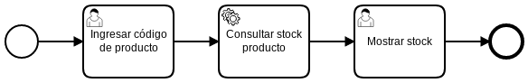

# Consultar Stock 1

|   Nr. | Tópico                            | Actividad                                                                                                                                                                                                                                                                                                                                                                                                                                                                                   |
| :---: | :---                              | :---                                                                                                                                                                                                                                                                                                                                                                                                                                                                                        |
|     1 | **StartEvent**                    | 1. En la pestaña 'General', configura el parámetro **Initiator** = 'starter'                                                                                                                                                                                                                                                                                                                                                                                                                |
|     2 | **'Ingresar código de producto' User Task** | .1 En la pestaña 'General', configura el parámetro **Assignee** = '${starter}'. 2. En la pestaña 'Forms' agrega una variable del siguiente modo: 2a. **ID** = 'codigo', **Type** = 'string', **Label** = 'Código del producto'.                                                                                                                                                                                                                              |
|     3 | **'Mostrar stock' User Task** | 1. En la pestaña 'General', configura el parámetro **Assignee** = '${starter}'. 2. En la pestaña 'Forms', agrega las siguientes variables del siguiente modo: 2a. **ID** = 'codigo', **Type** = 'string', **Label** = 'Código del producto', **Add Constraint** -> **Name** = 'readonly'. 2b. **ID** = 'nombre, **Type** = 'string', **Label** = 'Nombre del producto', **Add Constraint** -> **Name** = 'readonly'. 2c. **ID** = 'stock', **Type** = 'string', **Label** = 'Stock del producto', **Add Constraint** -> **Name** = 'readonly'.                                                                                                                                                                       |
|     4 | **'Consultar stock producto' Service Task** | 1. Configura el parámetro 'Implementation' = 'Connector'.   2. Muévete a la pestaña **Connector**. Configura el parámetro **Connector Id** = 'http-connector'.  3. Agrega los siguientes **Input Parameter**:  3a. **Name** = 'method'. **Type** = 'Text'. **Value** = 'GET'.   3b. **Name** = 'url'. **Type** = 'Script'. **Script Format** = 'freemarker'. **Script Type** = 'Inline Script'. **Script** = 'http://localhost:8000/stock/${codigo}'.  4. Agrega los siguientes **Output Parameter**:  4a. **Name** = 'nombre'. **Type** = 'Script'. **Script Format** = 'javascript'. **Script Type** = 'Inline Script'. **Script** = 'S(response).prop('nombre').value()'.   3b. **Name** = 'stock'. **Type** = 'Script'. **Script Format** = 'javascript'. **Script Type** = 'Inline Script'. **Script** = 'Number(S(response).prop('stock').value().toString())'.                                                                                                                                                                                                |
