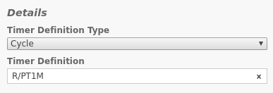
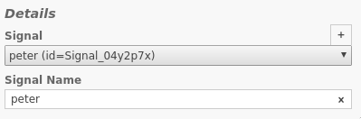
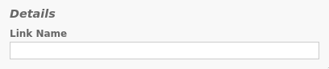
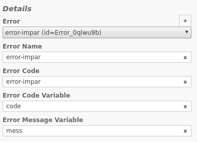

# Timer Event

URL: [https://docs.camunda.org/manual/7.8/reference/bpmn20/events/timer-events/](https://docs.camunda.org/manual/7.8/reference/bpmn20/events/timer-events/)

## Formatos

### Momento específico

\<año\>-\<mes\>-\<día\>T\<hora\>:\<minuto\>:\<segundos\>

Si se agrega una Z al final será UTC.

2018-05-09T15:30:00Z

Tambien se puede agregar un offset, para elegir TZ.
Por ejemplo:

2018-05-09T15:30:00-04

### Duración

P\<fecha\>T\<tiempo\>

- PT10M :: 10 minutos.
- PT2H10M20S :: 2 horas 10 minutos y 20 segundos.
- P1Y2M3D :: 1 año 2 meses y 3 días.
- P1DT3H :: 1 día y 3 horas.
- P1W :: 1 semana.

### Ciclo

Es necesario usar **CRON Jobs**

URL: [Tutorial](http://www.quartz-scheduler.org/documentation/quartz-2.1.x/tutorials/tutorial-lesson-06.html)

\<segundos\> \<minutos\> \<horas\> \<día del mes\> \<mes\> \<día de la semana\>

- \- define un intervalo (Ej: 7-9)
- , sirve para enumerar (Ej: 1,5,7)
- / define incrementos (Ej: 1/5 define 1,6,11,...)
- ? campo opcional
- \* cualquiera

Ejemplos

- 0 0/5 * * * ? :: Cada 5 minutos a partir de la hora.
- 2/30 0 * * * ? :: Cada 30 segundos a partir del segundo 2.
- 0 15 13-15 * * * "MON,WED" :: Lunes y Miércoles a las 13:15, 14:15 y 15:15.

\newpage
# Signal Event

URL: [https://docs.camunda.org/manual/7.8/reference/bpmn20/events/signal-events/](https://docs.camunda.org/manual/7.8/reference/bpmn20/events/signal-events/)

Si no se selecciona un signal en el **catch event** se aceptará cualquier señal.

# Link Event

URL: [https://docs.camunda.org/manual/7.8/reference/bpmn20/events/link-events/](https://docs.camunda.org/manual/7.8/reference/bpmn20/events/link-events/)

Link name debe ser el mismo en el **throw** y **catch** event.

# Terminate Event

URL [https://docs.camunda.org/manual/7.8/reference/bpmn20/events/terminate-event/](https://docs.camunda.org/manual/7.8/reference/bpmn20/events/terminate-event/)

\newpage
# Error Event

URL [https://docs.camunda.org/manual/7.8/reference/bpmn20/events/error-events/](https://docs.camunda.org/manual/7.8/reference/bpmn20/events/error-events/)

Actualmente no es posible definir un mensage de error. Solo un código.

# Compensation y Cancel Event

URL [https://docs.camunda.org/manual/7.8/reference/bpmn20/events/cancel-and-compensation-events/](https://docs.camunda.org/manual/7.8/reference/bpmn20/events/cancel-and-compensation-events/)

[Transaction Subprocess URL](https://docs.camunda.org/manual/7.8/reference/bpmn20/subprocesses/transaction-subprocess/)

Ningún problema
