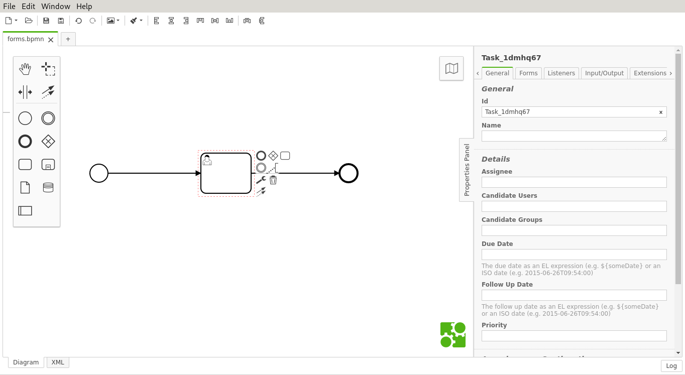
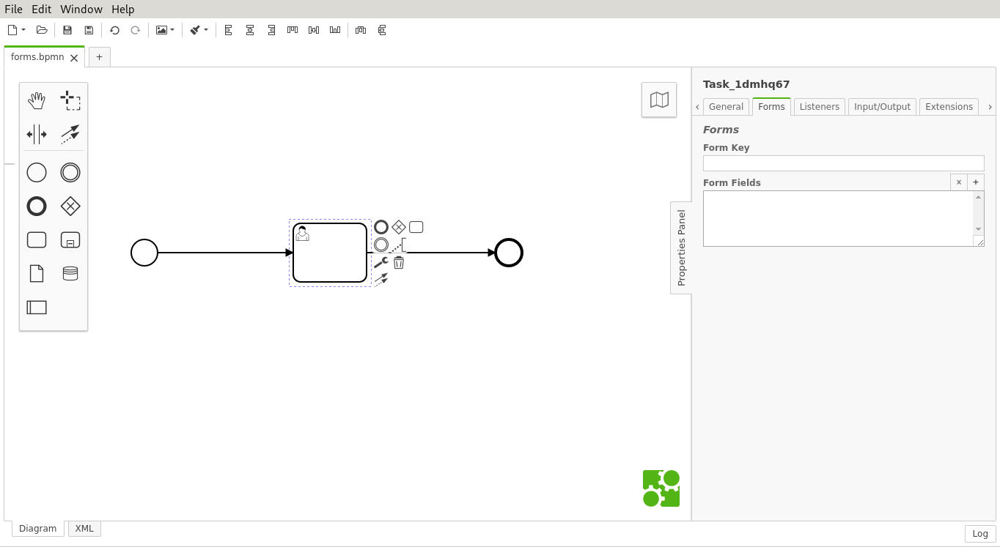
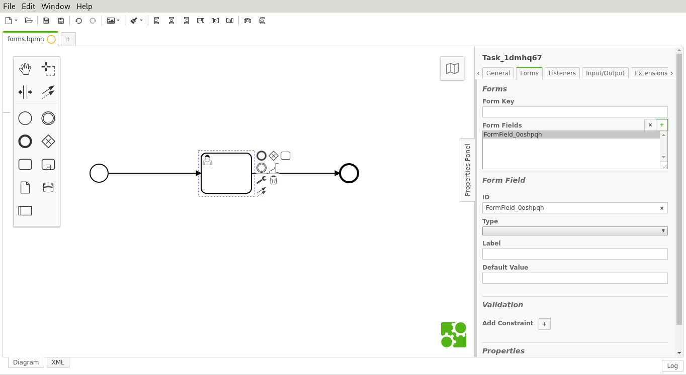
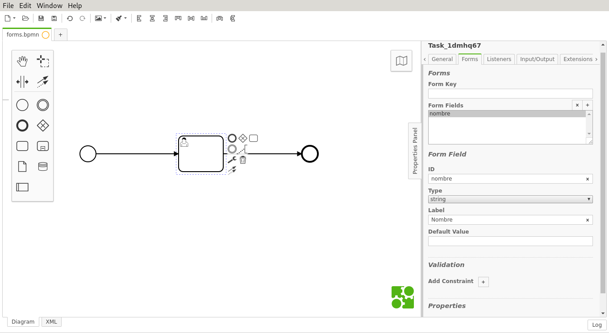
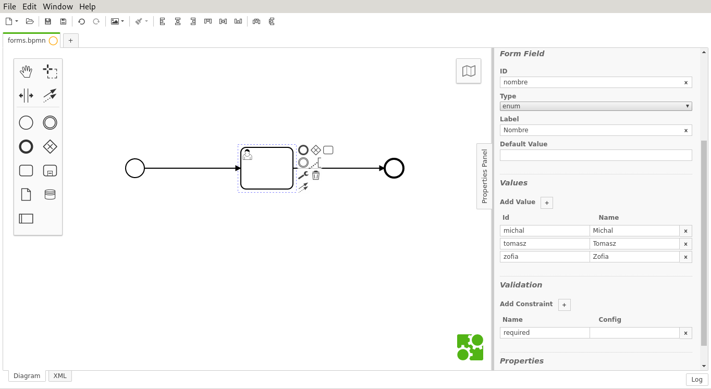
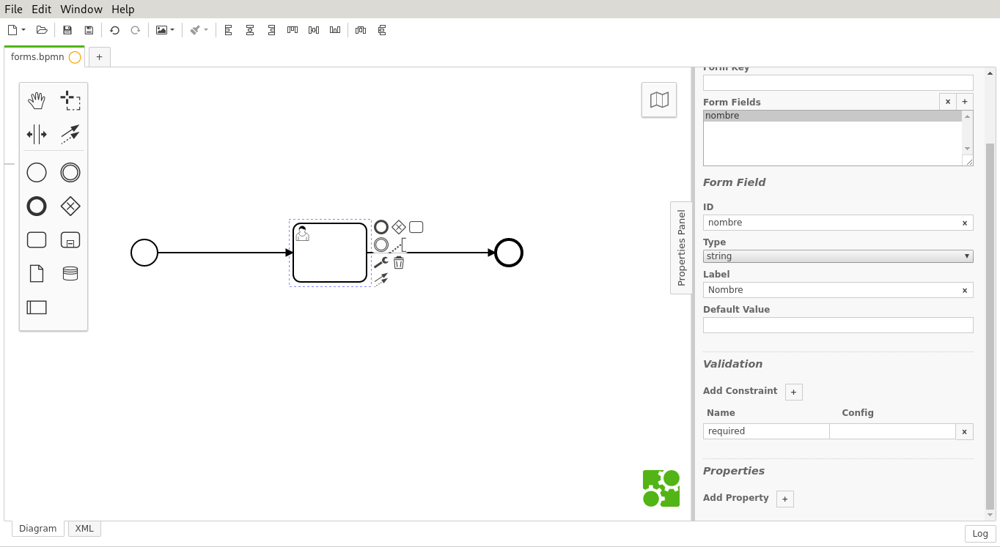

Presionar el Usertask.

En el menú de la derecha precionar la pestaña **Forms**.

Para agregar un campo al formulario es necesario
presionar el botón **+** a la derecha de **Form Fields**.

Es posible agregar múltiples campos de esta forma.

\newpage
# Información del campo

Rellenar la información del campo

- **ID**: Identificador del campo (debe ser único).
- **Type**: El tipo del campo. Seleccionar uno:
  - **string**: Texto
  - **long**: Número
  - **boolean**: Valor de verdad (Verdadero o Falso).
  - **date**: Fecha.
  - **enum**: Menú desplegable.
- **Label**: Nombre del campo.
- **Default Value**: Valor por defecto (opcional).

\newpage
## Enum

Para agregar una opción al menú desplegable es necesario
presionar el botón **+** junto a **Add value** en la sección **Value**.

Rellenar la información de la opción.

- **Id**: Identificador de la opción (debe ser único).
- **Name**: Nombre de la opción.

\newpage
# Validación

Presionar el botón **+** junto a **Add Constraint** 
en la sección **Validation**.

Los siguientes son los tipos de validación disponibles.

## Requerido

El campo debe ser rellenado.

- **Name**: required
- **Config**: 

## Largo mínimo

Largo mínimo de la entrada. Sólo aplicable a **string**:

- **Name**: minlength
- **Config**: [Tamaño (debe ser un número entero)]

## Largo máximo

Largo máximo de la entrada. Sólo aplicable a **string**:

- **Name**: maxlength
- **Config**: [Tamaño (debe ser un número entero)]

## Valor mínimo

Valor mínimo de la entrada. Sólo aplicable a **long**:

- **Name**: min
- **Config**: [Valor mínimo]

## Valor máximo

Valor máximo de la entrada. Sólo aplicable a **long**:

- **Name**: max
- **Config**: [Valor máximo]

## Sólo lectura

El valor del campo no es modificable por el usuario.

- **Name**: readonly
- **Config**:

