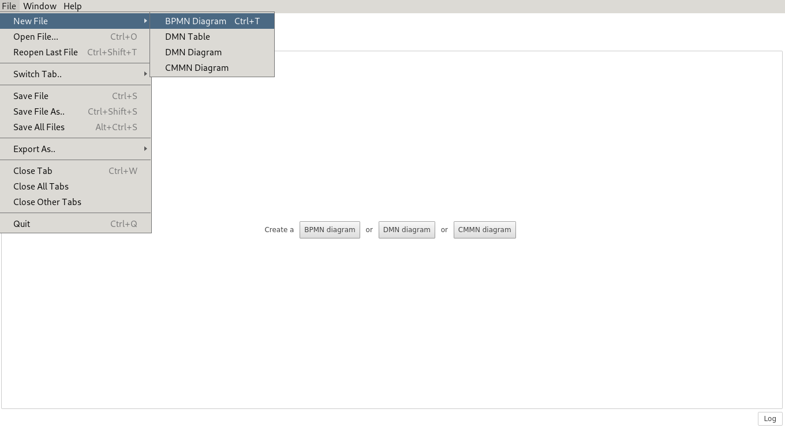
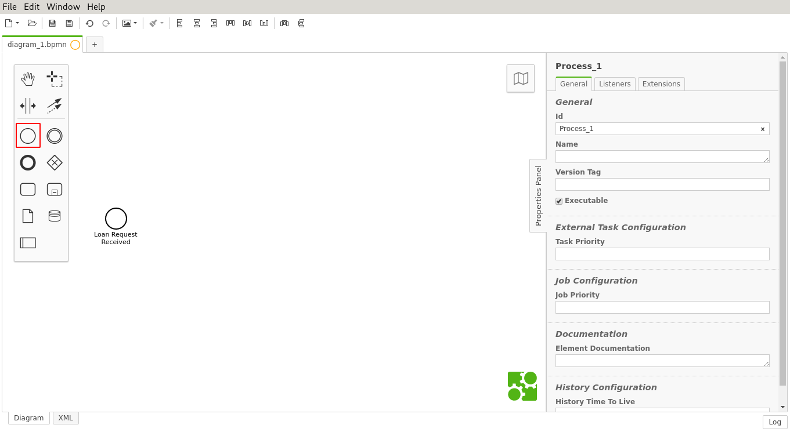
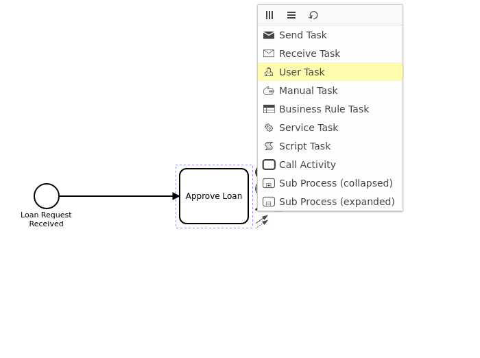
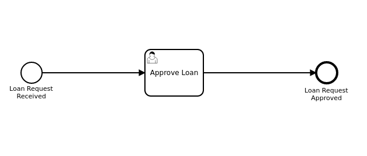
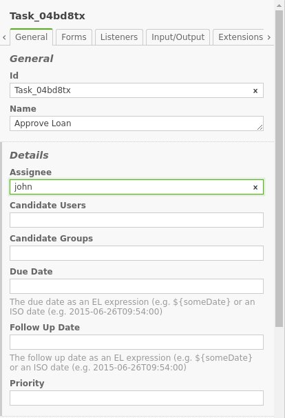
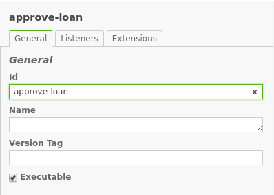
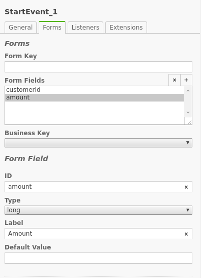

# Crear proyecto Camunda

Seguir instrucciones para crear un proyecto.

# Modelar proceso BPMN 2.0

En esta sección, aprenderás cómo crear tu primer rpoceso BPMN 2.0 con Camunda Modeler. Ahora, inicia Camunda Modeler.

## Crear un nuevo diagrama BPMN 2.0

Crea un nuevo diagrama BPMN clickando "**File** $\Rightarrow$ **New File** $\Rightarrow$ **BPMN diagram**".

Haz doble-click sobre "Start Event". Una caja de texto se abrirá. 
Escribe “Loan Request Received”. 
Ahora, haz un click sobre "Start Event". 
Sobre el menú que se despliega, selecciona el rectángulo y desplázalo hacia
una buena posición. 
Nómbralo "Approve Loan". 
Cambia el tipo de la actividad a "User Task", clickando sobre el rectángulo
y luego clickando la llave inglesa.

Clicka sobre el rectángulo que creaste, selecciona "End Event" y desplázalo a un posición adecuada. Nómbralo "Loan Request Approved".

## Configura el "User Task"

Ahora, abre la vista de propiedades. Si no está visible, clicka sobre la viñeta en la derecha de tu pantalla y la vista se desplegará.
Clicka sobre el **User Task**. Esto actualizará la selección en la vista de propiedades. Baja hasta el campo llamado **Assignee*** y escribe "john".
Cuando estés listo, guarda los cambios.

## Configura las propiedades para la ejecución

Como estamos modelando un proceso ejecutable, deberíamos darle un **ID** y configurar la propiedad **isExecutable** igual a "true". Clicka en un espacio vacío del diagrama para que se muestren las propiedades generales del flujo en la vista de propiedades.\\
Primero, configura un **ID** para el proceso. Escribe "approve-loan" en el atributo Id. El **ID** es usado por el motor del proceso como un identificador, y se considera una buena práctica darle un valor en lenguaje natural.\\
Segundo, configura el nombre del proceso. Escribe "Loan Approval" en el campo **Name**.\\
Finalmente, clicka sobre el cuadro a la izquierda del atributo **Executable**. Si no clickas este cuadro, la definción del proceso será ignorada por el motor de proceso.

## Agrega formularios

Siguiendo las instrucciones para agregar formularios a los **UserTask**
agrega los siguientes campos a **Start Event** y **User Task**:

### Start Event

#### Customer ID

  - **ID**: customerId
  - **Type**: string
  - **Label**: Customer ID
  
#### Amount

  - **ID**: amount
  - **Type**: long
  - **Label**: Amount

### User Task

#### Customer ID

  - **ID**: customerId
  - **Type**: string
  - **Label**: Customer ID
  - **Validation**: **ReadOnly**
  
#### Amount

  - **ID**: amount
  - **Type**: long
  - **Label**: Amount

