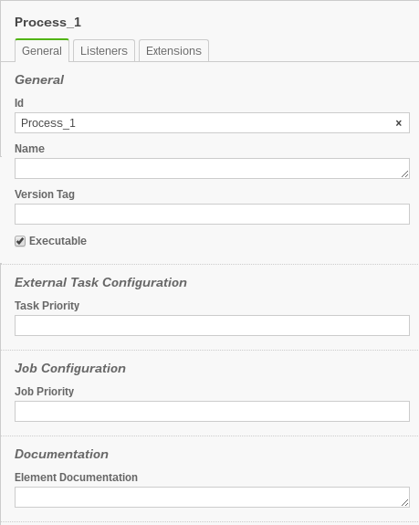

# Asignar atributos a User Task
En la documentación de camunda, están todas las instrucciones para modelar un "User Task". Para revisarlo, puedes usar el siguiente enlace: https://docs.camunda.org/manual/7.8/reference/bpmn20/tasks/user-task/.

# Asignar atributos directamente en el modeler

Puedes asignar ciertos atributos a user task, directamente en el modeler. Los atributos que puedes llenar directamente son: ID, name, documentation, "due date", "follow up date", "User assignment".

Para asignar ID, name, documentation al user task, puedes hacerlo directo en modeler. Abre la ventana de propiedades a la derecha y en la pestaña "general" encuentras todos esos campos.
Fíjate que en la documentación mencionan la sección "User Assignment", y los describen como un proceso muy engorroso, sin embargo, esto es equivalente a ingresar cada atributo en el modeler. "Human Performer" es equivalente a llenar el campo "asignee". "Potential owner" es equivalente a llenar el campo "Candidate users" y / o "Candidate groups". 

{height=50%}