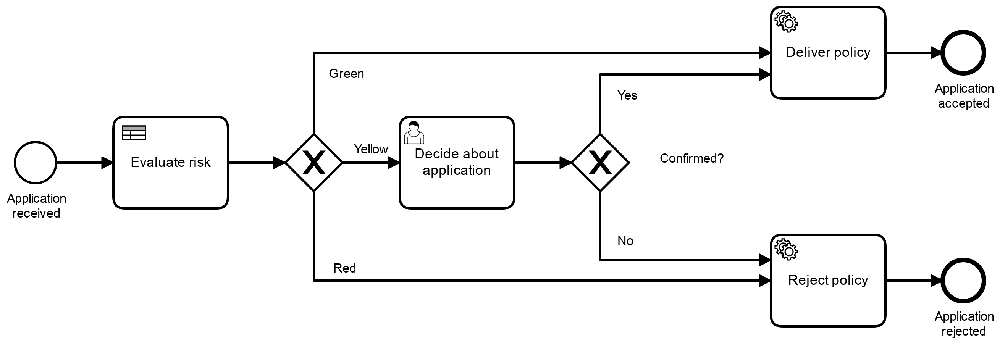
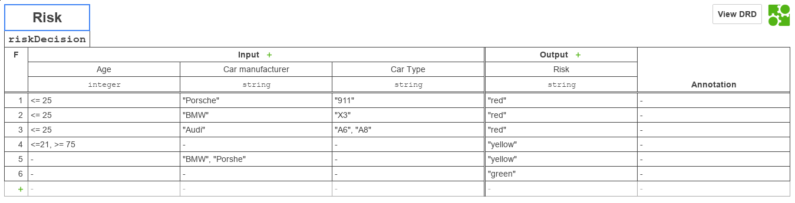

# Proceso BPM

|   Nr. | Tópico                            | Actividad                                                                                                                                                                                                                                                                                                                                                                                                                                                                                   |
| :---: | :---                              | :---                                                                                                                                                                                                                                                                                                                                                                                                                                                                                        |
|     1 | **Modelo**         | 1. Sin seleccionar ningún objeto, asegure que el 'General' esté seleccionada la opción 'Executable'.  2. Ingresar los siguentes datos:  **Id** = 'Autos'   **Name** = 'Autos'.                                                                                                                                                                                                                                                                          |
|     2 | **'Evaluate risk' Business Rule Task** | 1. En la pestaña 'General', configura el parámetro **Implementation** = 'DMN', **Desicion Ref** = 'riskDecision', **Result Variable** = 'riskLevel', **Map Desicion Result** = 'sigleEntry'.|
|     3 | **'Deliver policy' Send Task** | 1. Configura el parámetro 'Implementation' = 'Connector'.   2. Muévete a la pestaña **Connector**. Haz el atributo **Connector Id** = 'mail-send'.  3. Agrega los siguientes **Input Parameters**:  3a. **Name** = 'to'. **Type** = 'Text'. **Value** = `#{email}`.   3b. **Name** = 'subject'. **Type** = 'Text'. **Value** = `Your Car insurance application at Camundanzia!`.  3c. **Name** = 'text'. **Type** = 'Text'. **Value** = `Dear madam or sir,\n\nthank you very much for your application.\n\nBest regards\nYour Camundanzia team`.  |
|     4 | **'Reject policy' Send Task** | 1. Configura el parámetro 'Implementation' = 'Connector'.   2. Muévete a la pestaña **Connector**. Haz el atributo **Connector Id** = 'mail-send'.  3. Agrega los siguientes **Input Parameters**:  3a. **Name** = 'to'. **Type** = 'Text'. **Value** = `#{email}`.   3b. **Name** = 'subject'. **Type** = 'Text'. **Value** = `Your Car insurance application at Camundanzia!`.  3c. **Name** = 'text'. **Type** = 'Text'. **Value** = `Dear madam or sir,\n\nthank you very much for your application.\n\nBest regards\nYour Camundanzia team`.  |
|     5 | **'Decide about application' User Task** | 1. En la pestaña 'Forms' agrega variables del siguiente modo: 1a. **ID** = 'approved', **Type** = 'boolean', **Label** = 'Approve?'. |
|     6 | **'green' flujo** | 1. Configura el parámetro 'Condition Type' = 'Expression' y 'Expression' = '${riskLevel == 'green'}'.                                                                                                                                                                                                                                                                                                                                                                                      |
|     7 | **'yellow' flujo** | 1. Configura el parámetro 'Condition Type' = 'Expression' y 'Expression' = '${riskLevel == 'yellow'}'.                                                                                                                                                                                                                                                                                                                                                                                      |
|     8 | **'red' flujo** | 1. Configura el parámetro 'Condition Type' = 'Expression' y 'Expression' = '${riskLevel == 'red'}'.                                                                                                                                                                                                                                                                                                                                                                                      |
|     9 | **'Yes' flujo** | 1. Configura el parámetro 'Condition Type' = 'Expression' y 'Expression' = '${approved}'.                                                                                                                                                                                                                                                                                                                                                                              |
|     10 | **'No' flujo** | 1. Configura el parámetro 'Condition Type' = 'Expression' y 'Expression' = '${!approved}'.                                                                                                                                                                                                                                                                                                                                                                             |

# DMN

## DMN Risk

Llenar las tablas como aparece en la figura.

### Información importante:

| Id           | Name  | Hit Policy |
| :---:        | :---: | :---:      |
| riskDecision | Risk  | F (FIRST)  |

### Entradas

| Columna | Input Label      | Input Expression | Type    |
|   :---: | :---:            | :---:            | :---:   |
|       1 | Age              | age              | integer |
|       2 | Car manufacturer | manufacturer     | string  |
|       3 | Car type         | cartype          | string  |

### Salidas

| Columna | Output Label | Output Name   | Type   |
| :---:   | :---:        | :---:         | :---:  |
| 1       | Risk         | riskLevel     | string |
