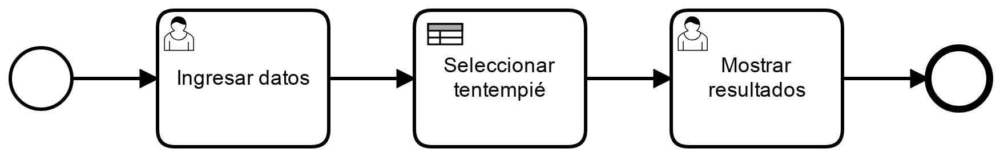
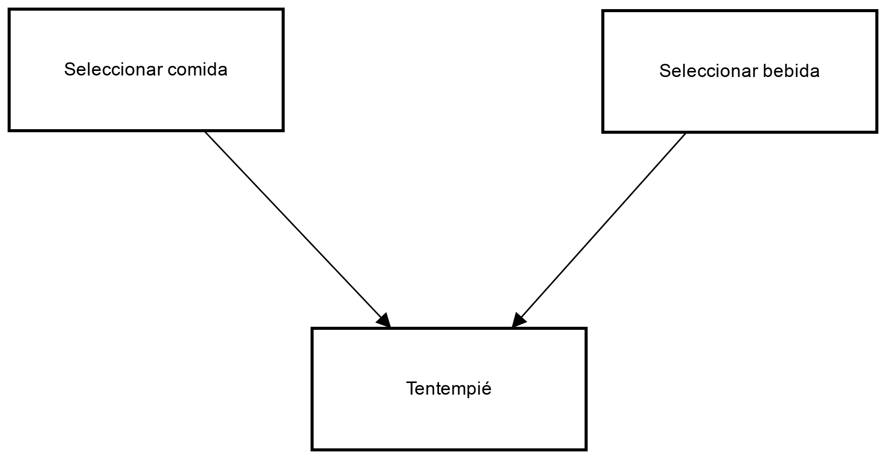
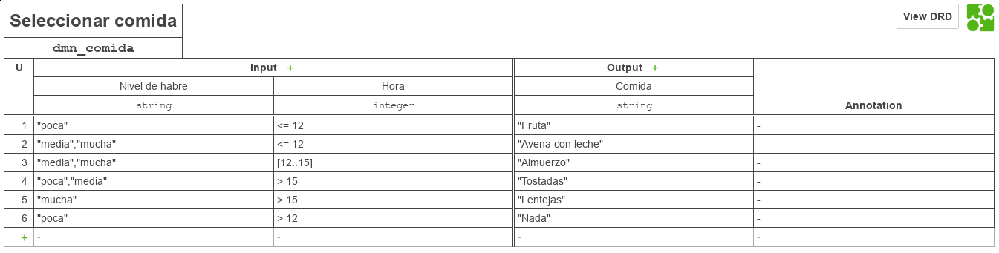
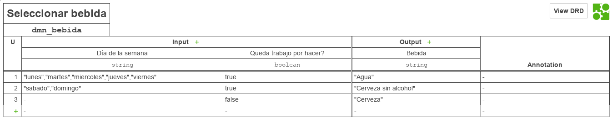
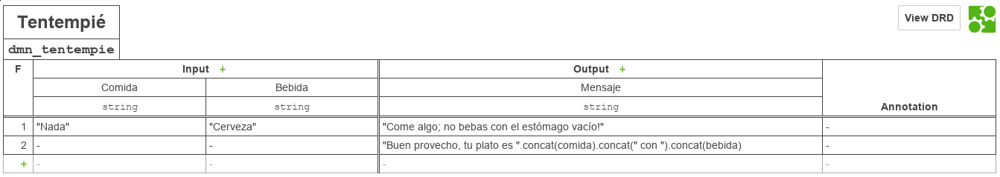

# Proceso BPM

|   Nr. | Tópico                            | Actividad                                                                                                                                                                                                                                                                                                                                                                                                                                                                                   |
| :---: | :---                              | :---                                                                                                                                                                                                                                                                                                                                                                                                                                                                                        |
|     1 | **StartEvent**                    | 1. En la pestaña 'General', configura el parámetro **Initiator** = 'starter' 'starter' es una variable en la que almacenaremos el ID de la persona que inicia el flujo.                                                                                                                                                                                                                                                                                                                                                                                                                |
|     2 | **'Ingresar datos' User Task** | 1 En la pestaña 'General', configura el parámetro **Assignee** = '${starter}'. 2. En la pestaña 'Forms' agrega variables del siguiente modo: 2a. **ID** = 'dia', **Type** = 'enum', **Label** = 'Día de la semana',   **Values**   **Id** = 'lunes', **Name** = 'Lunes'    **Id** = 'martes', **Name** = 'Martes'   **Id** = 'miercoles', **Name** = 'Miércoles'   **Id** = 'jueves', **Name** = 'Jueves'   **Id** = 'viernes', **Name** = 'Viernes'   **Id** = 'sabado', **Name** = 'Sábado'   **Id** = 'domingo', **Name** = 'Domingo'  **Validation**   **name** = 'required'  2b. **ID** = 'hora', **Type** = 'long', **Label** = 'Hora del día',   **Validation**   **name** = 'required'   **name** = 'min', **Config** = '1'   **name** = 'max', **Config** = '24'.    2c. **ID** = 'hambre', **Type** = 'enum', **Label** = 'Cuanta hambre tienes?',   **Values**   **Id** = 'poca', **Name** = 'Poca'   **Id** = 'media', **Name** = 'Media'   **Id** = 'mucha', **Name** = 'Mucha'  2d. **ID** = 'trabajo', **Type** = 'boolean', **Label** = 'Aún no terminas de trabajar?'                                 |
|     3 | **'Ver resultado' User Task** | 1. En la pestaña 'General', configura el parámetro **Assignee** = '${starter}'. 2. En la pestaña 'Forms', agrega una variable del siguiente modo: 2a. **ID** = 'comida', **Type** = 'string', **Label** = 'Comida'.   **Validation**   **name** = 'readonly'.    2b. **ID** = 'bebida', **Type** = 'string', **Label** = 'Bebida'.   **Validation**   **name** = 'readonly'  2c. **ID** = 'mensaje', **Type** = 'string', **Label** = 'Mensaje'.   **Validation**   **name** = 'readonly'                                                                                                                                                    |
|     4 | **'Seleccionar tentempié' Business Rule Task** | 1. En la pestaña 'General', configura el parámetro **Implementation** = 'DMN', **Desicion Ref** = 'dmn_tentempie', **Result Variable** = 'resultado', **Map Desicion Result** = 'singleResult'.   2. En la pestaña "Input/Output" agregar los siguientes "Output Parameters":   2a. **Name** = 'comida', **Type** = 'Text', **Value** = '${resultado.comida}'     2b. **Name** = 'bebida, **Type** = 'Text', **Value** = '${resultado.bebida}'   2c. **Name** = 'mensaje', **Type** = 'Text', **Value** = '${resultado.mensaje}'|
|     5 | **Modelo**         | 1. Sin seleccionar ningún objeto, asegure que el 'General' esté seleccionada la opción 'Executable'.  2. Ingresar los siguentes datos:  **Id** = 'process_tentempie'   **Name** = 'Elegir tentempié'.                                                                                                                                                                                                                                                                                                               |

# DMN

## Diagrama de decisión

Crear las tres tablas de decisión como aparece en la figura.
Seleccionar cada una y cambiar su tipo presionando en la llave inglesa a "Decision Table".

## DMN Seleccionar Comida

Llenar las tablas como aparece en la figura.

### Información importante:

| Id         | Name               | Hit Policy |
| :---:      | :---:              | :---:      |
| dmn_comida | Seleccionar comida | U (UNIQUE) |

### Entradas

| Columna | Input Label     | Input Expression | Type    |
|   :---: | :---:           | :---:            | :---:   |
|       1 | Nivel de hambre | hambre           | string  |
|       2 | Hora            | hora             | integer |

### Salidas

| Columna | Output Label | Output Name | Type   |
| :---:   | :---:        | :---:       | :---:  |
| 1       | Comida       | comida      | string |

## DMN Seleccion Bebida

Llenar las tablas como aparece en la figura.

### Información importante:

| Id         | Name               | Hit Policy |
| :---:      | :---:              | :---:      |
| dmn_bebida | Seleccionar bebida | U (UNIQUE) |

### Entradas

| Columna | Input Label              | Input Expression | Type   |
| :---:   | :---:        | :---:       | :---:  |
|       1 | Día de la semana         | dia              | string |
|       2 | Queda trabajo por hacer? | trabajo          | boolean |

### Salidas

| Columna | Output Label | Output Name | Type   |
| :---:   | :---:        | :---:       | :---:  |
|       1 | Bebida       | bebida      | string |

## DMN Tentempié

Llenar las tablas como aparece en la figura.

### Información importante:

| Id            | Name      | Hit Policy |
| :---:         | :---:     | :---:      |
| dmn_tentempie | Tentempié | F (UNIQUE) |

### Entradas

| Columna | Input Label | Input Expression | Type    |
| :---:   | :---:        | :---:       | :---:  |
|       1 | Comida      | comida           | string  |
|       2 | Bebida      | bebida           | string  |

### Salidas

| Columna | Output Label | Output Name | Type   |
| :---:   | :---:        | :---:       | :---:  |
|       1 | Mensaje      | mensaje     | string |
|       2 | Comida       | comida      | string |
|       3 | Bebida       | bebida      | string |
