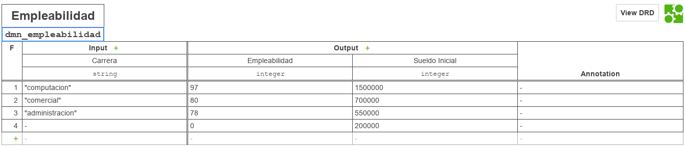

# Proceso BPM

|   Nr. | Tópico                            | Actividad                                                                                                                                                                                                                                                                                                                                                                                                                                                                                   |
| :---: | :---                              | :---                                                                                                                                                                                                                                                                                                                                                                                                                                                                                        |
|     1 | **StartEvent**                    | 1. En la pestaña 'General', configura el parámetro **Initiator** = 'starter' 'starter' es una variable en la que almacenaremos el ID de la persona que inicia el flujo.                                                                                                                                                                                                                                                                                                                                                                                                                |
|     2 | **'Ingresar datos' User Task** | 1 En la pestaña 'General', configura el parámetro **Assignee** = '${starter}'. 2. En la pestaña 'Forms' agrega variables del siguiente modo: 2a. **ID** = 'carrera', **Type** = 'enum', **Label** = 'Carrera',   **Values**   **Id** = 'computacion', **Name** = 'Computacion'    **Id** = 'comercial', **Name** = 'Ingeniería Comercial'   **Id** = 'administracion', **Name** = 'Administración Pública'   **Id** = 'otros', **Name** = 'Otros'  |
|     3 | **'Mostrar resultados' User Task** | 1. En la pestaña 'General', configura el parámetro **Assignee** = '${starter}'. 2. En la pestaña 'Forms', agrega una variable del siguiente modo: 2a. **ID** = 'empleabilidad', **Type** = 'string', **Label** = 'Porcentaje de empleabilidad'.   **Validation**   **name** = 'readonly'.    2b. **ID** = 'sueldo', **Type** = 'string', **Label** = 'Sueldo inicial'.   **Validation**   **name** = 'readonly'  |
|     4 | **'Seleccionar tentempié' Business Rule Task** | 1. En la pestaña 'General', configura el parámetro **Implementation** = 'DMN', **Desicion Ref** = 'dmn_empleabilidad', **Result Variable** = 'resultado', **Map Desicion Result** = 'singleResult'.   2. En la pestaña "Input/Output" agregar los siguientes "Output Parameters":   2a. **Name** = 'empleabilidad', **Type** = 'Text', **Value** = 'resultado.empleabilidad'     2b. **Name** = 'sueldo', **Type** = 'Text', **Value** = 'resultados.sueldo'|
|     5 | **Modelo**         | 1. Sin seleccionar ningún objeto, asegure que el 'General' esté seleccionada la opción 'Executable'.  2. Ingresar los siguentes datos:  **Id** = 'process_empleabilidad   **Name** = 'Empleabilidad'.                                                                                                                                                                                                                                                                                     |

# DMN

## DMN Empleabilidad

Llenar las tablas como aparece en la figura.

### Información importante:

| Id                | Name          | Hit Policy |
| :---:             | :---:         | :---:      |
| dmn_empleabilidad | Empleabilidad | F (FIRST) |

### Entradas

| Columna | Input Label     | Input Expression | Type    |
|   :---: | :---:           | :---:            | :---:   |
|       1 | Carrera | carrera    | string  |

### Salidas

| Columna | Output Label  | Output Name   | Type   |
|   :---: | :---:         | :---:         | :---:  |
|       1 | Empleabilidad | empleabilidad | string |
|       2 | Sueldo        | sueldo        | string |
