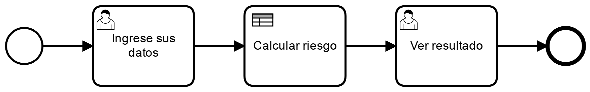
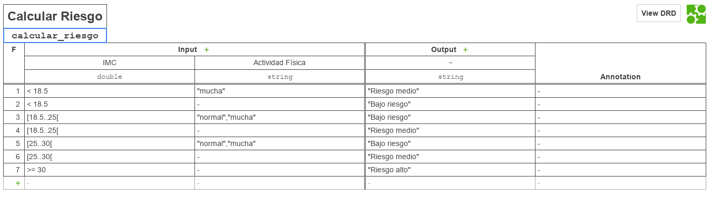

# Solicitar Insumo

|   Nr. | Tópico                            | Actividad                                                                                                                                                                                                                                                                                                                                                                                                                                                                                   |
| :---: | :---                              | :---                                                                                                                                                                                                                                                                                                                                                                                                                                                                                        |
|     1 | **StartEvent**                    | 1. En la pestaña 'General', configura el parámetro **Initiator** = 'starter' 'starter' es una variable en la que almacenaremos el ID de la persona que inicia el flujo.                                                                                                                                                                                                                                                                                                                                                                                                                |
|     2 | **'Ingrese sus datos' User Task** | 1 En la pestaña 'General', configura el parámetro **Assignee** = '${starter}'. 2. En la pestaña 'Forms' agrega variables del siguiente modo: 2a. **ID** = 'altura', **Type** = 'long', **Label** = 'Altura (cm)', **Default Value** = '170',   **Validation**   **name** = 'min', **Config** = '1'.   2b. **ID** = 'peso', **Type** = 'long', **Label** = Peso (kg)', **Default Value** = '70',   **Validation**   **name** = 'min', **Config** = '1'.  2c. **ID** = 'actividad_fisica', **Type** = 'enum', **Label** = 'Actividad Física',   **Values**   **Id** = 'nada', **Name** = 'Nada'   **Id** = 'poca', **Name** = 'Poca'   **Id** = 'normal', **Name** = 'Normal'   **Id** = 'mucha', **Name** = 'Mucha'.                                                        |
|     3 | **'Ver resultado' User Task** | 1. En la pestaña 'General', configura el parámetro **Assignee** = '${starter}'. 2. En la pestaña 'Forms', agrega una variable del siguiente modo: 2a. **ID** = 'resultado', **Type** = 'string', **Label** = 'Nivel de riesgo'.   **Validation**   **name** = 'readonly'.                                                                                                                                                                                                    |
|     4 | **'Calcular riesgo' Business Rule Task** | 1. En la pestaña 'General', configura el parámetro **Implementation** = 'DMN', **Desicion Ref** = 'calcular_riesgo', **Result Variable** = 'resultado', **Map Desicion Result** = 'singleEntry' |
|     5 | **Modelo**         | 1. Sin seleccionar ningún objeto, asegure que el 'General' esté seleccionada la opción 'Executable'.                                                                                                                                                                                                                                                                                                                                                                                                                         |
