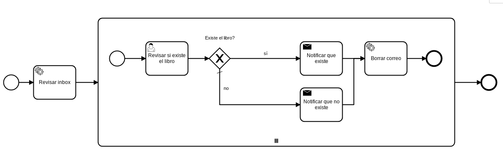

# Consulta Libro

|   Nr. | Tópico                                     | Actividad                                                                                                                                                                                                                                                                                                                                                                                                                                                                                                                                                                                                   |
| :---: | :---                                       | :---                                                                                                                                                                                                                                                                                                                                                                                                                                                                                                                                                                                                        |
|     1 | **'Revisar inbox' Service Task**           | 1. En la pestaña 'general' marca las opciones 'Asynchronous Before' y 'Exclusive'.   2. Configura el parámetro 'Implementation' = 'Connector'.   3. Muévete a la pestaña **Connector**. Haz el atributo **Connector Id** = 'mail-poll'.  3. Agrega el siguiente **Ouput Parameter**:  3a. **Name** = 'mails'. **Type** = 'Text'. **Value** = '${mails}'.                                                                                                                                                                                                                                        |
|     2 | **Subprocess Task**                        | 1. Usando el ícono de herramienta, agrega el parámetro 'Parallel Multi Instance'.   2. En la pestaña 'General', agrega **Collection**='${mails}' y **Element Variable**='mail'.                                                                                                                                                                                                                                                                                                                                                                                                                          |
|     3 | **'Revisar si existe el libro' User Task** | 1. En la pestaña 'Forms' agrega dos variables del siguiente modo:  1a. **ID** = 'correo', **Type** = 'string', **Label** = 'Solicitud', **Default value** = '${mail.getText()}'.  1b. **ID** = 'existe', **Type** = 'boolean', **Label** = 'Existe el libro?'.                                                                                                                                                                                                                                                                                                                                        |
|     4 | **'Notificar que existe' Send Task**       | 1. Configura el parámetro 'Implementation' = 'Connector'.   2. Muévete a la pestaña **Connector**. Haz el atributo **Connector Id** = 'mail-send'.  3. Agrega los siguientes **Input Parameters**:  3a. **Name** = 'to'. **Type** = 'Text'. **Value** = `${mail.getFrom()}`.   3b. **Name** = 'subject'. **Type** = 'Text'. **Value** = `${'RE: '.concat(mail.getSubject())}`.   3c. **Name** = 'text'. **Type** = 'Script'. **Script Format** = 'freemarker'. **Script Type** = 'Inline Script'. **Value** = 'Buenas tardes  El libro por el que consulta sí existe.  Saludos! |
|     5 | **'Notificar que no existe' Send Task**    | 1. Configura el parámetro 'Implementation' = 'Connector'.   2. Muévete a la pestaña **Connector**. Haz el atributo **Connector Id** = 'mail-send'.  3. Agrega los siguientes **Input Parameters**:  3a. **Name** = 'to'. **Type** = 'Text'. **Value** = `${mail.getFrom()}`.   3b. **Name** = 'subject'. **Type** = 'Text'. **Value** = `${'RE: '.concat(mail.getSubject())}`.   3c. **Name** = 'text'. **Type** = 'Script'. **Script Format** = 'freemarker'. **Script Type** = 'Inline Script'. **Value** = 'Buenas tardes  El libro por el que consulta no existe.  Saludos! |
|     6 | **'Borrar Correo' Service Task**           | 1. Configura el parámetro 'Implementation' = 'Connector'.   2. Muévete a la pestaña **Connector**. Configura el parámetro **Connector Id** = 'mail-delete'.  3. Agrega los siguientes **Input Parameter**:  3a. **Name** = 'mails'. **Type** = 'List'. **Value** = '${mail}'.                                                                                                                                                                                                                                                                                                                      |
|     6 | **'Existe el libro? sí'** flujo  | 1. Configura el parámetro 'Condition Type' = 'Expression' y 'Expression' = '#{existe}'.                                                                                                                                                                                                                                                                                                                                                                                                                                                                                                                     |
|     7 | **'Existe el libro? no' flujo** | 1. Usando el ícono de herramienta, cambia el tipo a 'Default Flow'.                                                                                                                                                                                                                                                                                                                                                                                                                                                                                                                                         |
