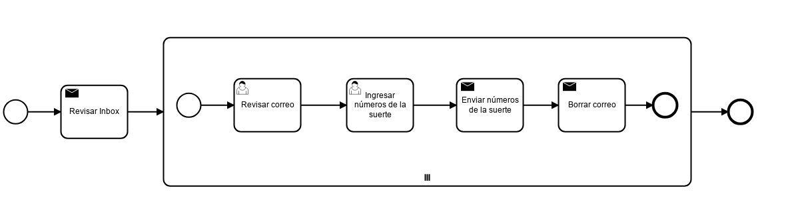

# Números de la suerte

|   Nr. | Tópico                                   | Actividad                                                                                                                                                                                                                                                                                                                                                                                                                                                                                                                                                                                                                             |
| :---: | :---                                     | :---                                                                                                                                                                                                                                                                                                                                                                                                                                                                                                                                                                                                                                  |
|     1 | **'Revisar inbox' Service Task**         | 1. En la pestaña 'general' marca las opciones 'Asynchronous Before' y 'Exclusive'.   2. Configura el parámetro 'Implementation' = 'Connector'.   3. Muévete a la pestaña **Connector**. Haz el atributo **Connector Id** = 'mail-poll'.  3. Agrega el siguiente **Ouput Parameter**:  3a. **Name** = 'mails'. **Type** = 'Text'. **Value** = '${mails}'.                                                                                                                                                                                                                                                                  |
|     2 | **Subprocess Task**                      | 1. Usando el ícono de herramienta, agrega el parámetro 'Parallel Multi Instance'.   2. En la pestaña 'General', agrega **Collection**='${mails}' y **Element Variable**='mail'.                                                                                                                                                                                                                                                                                                                                                                                                                                                    |
|     3 | **'Revisar correo' User Task**           | 1. En la pestaña 'Forms' agrega una variable del siguiente modo:  1a. **ID** = 'correo', **Type** = 'string', **Label** = 'Solicitud de números', **Default value** = '${mail.getText()}'.                                                                                                                                                                                                                                                                                                                                                                                                                                         |
|     4 | **'Ingresar números de la suerte' User Task** | 1. En la pestaña 'Forms' agrega tres variables del siguiente modo:  1a. **ID** = 'x', **Type** = 'long', **Label** = 'Primer número', **Validation->Add constraint->Name** = 'required'.   1b. **ID** = 'y', **Type** = 'long', **Label** = 'Segundo número', **Validation->Add constraint->Name** = 'required'.   1c. **ID** = 'z', **Type** = 'long', **Label** = 'Tercer número', **Validation->Add constraint->Name** = 'required'.                                                                                                                                                                                      |
|     4 | **'Enviar números de la suerte' Send Task** | 1. Configura el parámetro 'Implementation' = 'Connector'.   2. Muévete a la pestaña **Connector**. Haz el atributo **Connector Id** = 'mail-send'.  3. Agrega los siguientes **Input Parameters**:  3a. **Name** = 'to'. **Type** = 'Text'. **Value** = `${mail.getFrom()}`.   3b. **Name** = 'subject'. **Type** = 'Text'. **Value** = `${'RE: '.concat(mail.getSubject())}`.   3c. **Name** = 'text'. **Type** = 'Script'. **Script Format** = 'freemarker'. **Script Type** = 'Inline Script'. **Value** = 'Buenos días  Sus números de la suerte son ${x}, ${y} y ${z}.  Saludos!   |
|     6 | **'Borrar Correo' Service Task**         | 1. Configura el parámetro 'Implementation' = 'Connector'.   2. Muévete a la pestaña **Connector**. Configura el parámetro **Connector Id** = 'mail-delete'.  3. Agrega los siguientes **Input Parameter**:  3a. **Name** = 'mails'. **Type** = 'List'. **Value** = '${mail}'.                                                                                                                                                                                                                                                                                                                                                |
