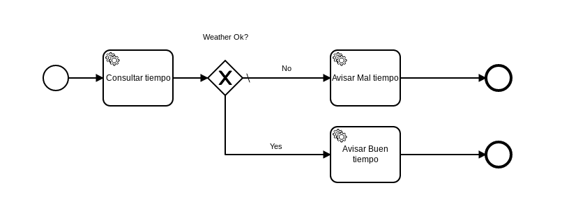

# Send email Example

|   Nr. | Topic                                 | Activity                                                                                                                                                                                                                                                                                                                                                                                                                                                                                                                                                                                                                                                                                                                                                                                                                                                                                                                                                                                                                                                                                                                                                                                                                                                                                                                                                                                                                                                                                    |
| :---: | :---                                  | :---                                                                                                                                                                                                                                                                                                                                                                                                                                                                                                                                                                                                                                                                                                                                                                                                                                                                                                                                                                                                                                                                                                                                                                                                                                                                                                                                                                                                                                                                                        |
|     1 | **Start Event**                       | 1. Add a form with a 'cityName' and 'correo' fields of type 'string' and a validation of name 'required' for both. |
|     2 | **'Consultar tiempo' Service Task**   | 1. Set the field 'Implementation' = 'Connector'.   2. Switch to the **Connector** tab. Set the **Connector Id** = 'http-connector'.  3. Add the following **Input Parameters**:  3a. **Name** = 'method'. **Type** = 'Text'. **Value** = 'GET'.   3b. **Name** = 'url'. **Type** = 'Script'. **Script Format** = 'freemarker'. **Script Type** = 'Inline Script'. **Script** = 'http://178.62.33.94:8000/weatherOk/${cityName}'. |
|     3 | **'Avisar buen tiempo' Service Task** | 1. Set the field 'Implementation' = 'Connector'.   2. Switch to the **Connector** tab. Set the **Connector Id** = 'mail-send'.  3. Add the following **Input Parameters**:  3a. **Name** = 'to'. **Type** = 'Text'. **Value** = '#{correo}'.   3b. **Name** = 'subject'. **Type** = 'Text'. **Value** = 'Weather'.   3c. **Name** = 'text'. **Type** = 'Text'. **Value** = 'El tiempo está bueno en #{cityName}.'. |
|     4 | **'Avisar mal tiempo' Service Task**  | 1. Set the field 'Implementation' = 'Connector'.   2. Switch to the **Connector** tab. Set the **Connector Id** = 'mail-send'.  3. Add the following **Input Parameters**:  3a. **Name** = 'to'. **Type** = 'Text'. **Value** = '#{correo}'.   3b. **Name** = 'subject'. **Type** = 'Text'. **Value** = 'Weather'.   3c. **Name** = 'text'. **Type** = 'Text'. **Value** = 'El tiempo está malo en #{cityName}.'. |
|     5 | **'Weather ok? Yes' Sequence Flow**   | 1. Set the field 'Condition Type' = 'Expression' and 'Expression' = '#{weatherOk}'. |
|     6 | **'Weather ok? No' Sequence Flow**    | 1. Using the tool icon change its type to a 'Default Flow'. |
