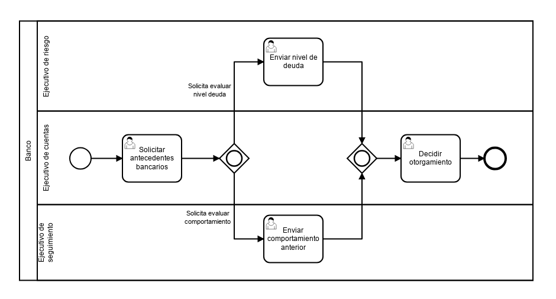

# Antecedentes bancarios

|   Nr. | Tópico                            | Actividad                                                                                                                                                                                                                                                                                                                                                                                                                                                                                   |
| :---: | :---                              | :---                                                                                                                                                                                                                                                                                                                                                                                                                                                                                        |
|     0 | **Requerimientos**                  | 1. Para la creación de usuarios y grupos necesarios para este ejemplo, consultar [Tutorial Usuarios](https://github.com/sigifredolaengle/camunda-classes/tree/master/User%20Task/Solicitar%20Insumo/creaci%C3%B3n-usuario).                                                                                                                                                                                                                                                                |
|     1 | **StartEvent**                    | 1. En la pestaña 'General', configura el parámetro **Initiator** = 'starter' 'starter' es una variable en la que almacenaremos el ID de la persona que inicia el flujo.                                                                                                                                                                                                                                                                                                                  |
|     2 | **'Solicitar antecedentes bancarios' User Task** | 1 En la pestaña 'General', configura el parámetro **Assignee** = '${starter}'. 2. En la pestaña 'Forms' agrega variables del siguiente modo: 2a. **ID** = 'deuda', **Type** = 'boolean', **Label** = 'Consultar nivel deuda?'. 2b. **ID** = 'comportamiento', **Type** = 'boolean', **Label** = 'Consultar comportamiento anterior'.  2c. **ID** = 'cliente', **Type** = 'long', **Label** = 'Rut del cliente (sin puntos ni guion)'.                                                                                                                                                                                                                        |
|     3 | **'Enviar nivel de deuda' User Task** | 1. En la pestaña 'General', configura el parámetro **Asignee** = 'ejecutivo_riesgo'. 2. En la pestaña 'Forms', agrega dos variables del siguiente modo: 2a. **ID** = 'ndeuda', **Type** = 'long', **Label** = 'Deuda en pesos', **Add Constraint** -> **Name** = 'required'.  2b. **ID** = 'cliente', **Type** = 'long', **Label** = 'Rut del cliente'.                                                                                                                                                                                      |
|     4 | **'Enviar comportamiento anterior' User Task** | 1. En la pestaña 'General', configura el parámetro **Asignee** = 'ejecutivo_seguimiento'. 2. En la pestaña 'Forms', agrega dos variable del siguiente modo: 2a. **ID** = 'anterior', **Type** = 'boolean', **Label** = 'Comportamiento bueno?', **Add Constraint** -> **Name** = 'required'.  2a. **ID** = 'cliente', **Type** = 'long', **Label** = 'Rut del cliente'.                                                                                                                                                                                                            
|     5 | **'Decidir otorgamiento' User Task** | 1. En la pestaña 'General', configura el parámetro **Assignee** = '${starter}'. 2. En la pestaña 'Forms', agrega dos variables del siguiente modo: 2a. **ID** = 'ndeuda', **Type** = 'long', **Label** = 'Deuda anterior en pesos', **Add Constraint** -> **Name** = 'readonly'. 2b. **ID** = 'anterior', **Type** = 'boolean', **Label** = 'Comportamiento bueno?', **Add Constraint** -> **Name** = 'readonly'.
|     6 | **'Solicitar evaluar nivel de deuda' flujo** | 1. Configura el parámetro 'Condition Type' = 'Expression' y 'Expression' = '${deuda}'.                                                                                                                                                                                                                                                                                                                                                                                                         |
|     8 | **'Solicitar evaluar comportamiento anterior' flujo** | 1. Configura el parámetro 'Condition Type' = 'Expression' y 'Expression' = '${anterior}'.                                                                                                                                                                                                                                                                                                                                                |
|     9 | **Modelo**                        | 1. Seleccionando el dibujo completo, asegúrate que en la pestaña 'General' esté seleccionada la opción 'Executable'.                                                                                                                                                                                                                                                                                                                                                |
