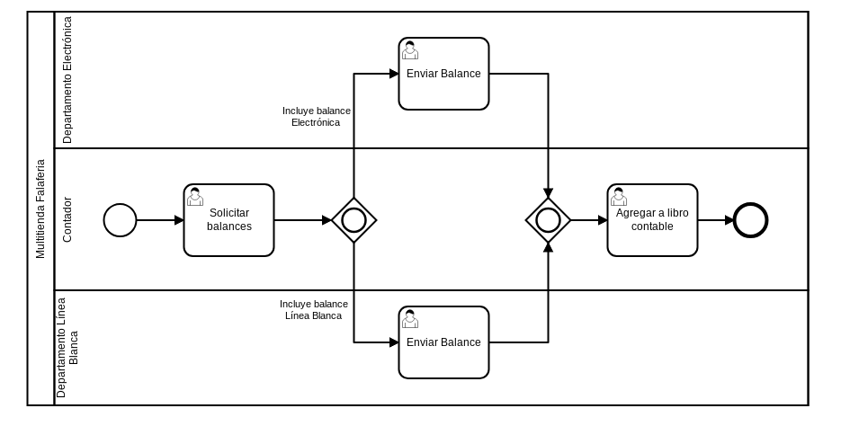

# Solicitar Insumo

|   Nr. | Tópico                            | Actividad                                                                                                                                                                                                                                                                                                                                                                                                                                                                                   |
| :---: | :---                              | :---                                                                                                                                                                                                                                                                                                                                                                                                                                                                                        |
|     0 | **Requerimientos**                  | 1. Para la creación de usuarios y grupos necesarios para este ejemplo, consultar [Tutorial Usuarios] (https://github.com/sigifredolaengle/camunda-classes/tree/master/User%20Task/Solicitar%20Insumo/creaci%C3%B3n-usuario).                                                                                                                                                                                                                                                                |
|     1 | **StartEvent**                    | 1. En la pestaña 'General', configura el parámetro **Initiator** = 'starter' 'starter' es una variable en la que almacenaremos el ID de la persona que inicia el flujo.                                                                                                                                                                                                                                                                                                                  |
|     2 | **'Solicitar Balances' User Task** | 1 En la pestaña 'General', configura el parámetro **Assignee** = '${starter}'. 2. En la pestaña 'Forms' agrega variables del siguiente modo: 2a. **ID** = 'electronica', **Type** = 'boolean', **Label** = 'Departamento Electrónica'. 2a. **ID** = 'linea-blanca', **Type** = 'boolean', **Label** = 'Línea Blanca'.                                                                                                                                                                                                                        |
|     3 | **'Enviar Balace Electrónica' User Task** | 1. En la pestaña 'General', configura el parámetro **Candidate Groups** = 'Electrónica'. 2. En la pestaña 'Forms', agrega una variable del siguiente modo: 2a. **ID** = 'balance-eletronica', **Type** = 'long', **Label** = 'Balance', **Default Value** = '0', **Add Constraint** -> **Name** = 'required'.                                                                                                                                                                                      |
|     4 | **'Enviar Balance Línea Blanca' User Task** | 1. En la pestaña 'General', configura el parámetro **Candidate Groups** = 'Línea Blanca'. 2. En la pestaña 'Forms', agrega una variable del siguiente modo: 2a. **ID** = 'balance-linea-blanca', **Type** = 'long', **Label** = 'Balance', **Default Value** = '0', **Add Constraint** -> **Name** = 'required'.                                                                                                                                                                                                            
|     5 | **'Agregar a libro contable' User Task** | 1. En la pestaña 'General', configura el parámetro **Assignee** = '${starter}'. 2. En la pestaña 'Forms', agrega dos variables del siguiente modo: 2a. **ID** = 'balance-electronica', **Type** = 'long', **Label** = 'Balance Electrónica', **Add Constraint** -> **Name** = 'readonly'. 2b. **ID** = 'balance-linea-blanca', **Type** = 'long', **Label** = 'Balance Línea Blanca', **Add Constraint** -> **Name** = 'readonly'.
|     6 | **'Incluye balance Electrónica' flujo** | 1. Configura el parámetro 'Condition Type' = 'Expression' y 'Expression' = '${electronica}'.                                                                                                                                                                                                                                                                                                                                                                                                         |
|     8 | **'Incluye balance Línea Blanca' flujo** | 1. Configura el parámetro 'Condition Type' = 'Expression' y 'Expression' = '${linea-blanca}'.                                                                                                                                                                                                                                                                                                                                                |
|     9 | **Modelo**                        | 1. Seleccionando el dibujo completo, asegúrate que en la pestaña 'General' esté seleccionada la opción 'Executable'.                                                                                                                                                                                                                                                                                                                                                |
