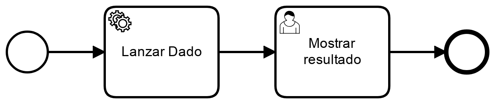

# Azar

## Documentación

[External Tasks](https://docs.camunda.org/manual/7.9/user-guide/process-engine/external-tasks/)

|   Nr. | Tópico                                        | Actividad                                                                                                                                                                                                                                                                                                                                                                                                                                                                                                                     |
| :---: | :---                                          | :---                                                                                                                                                                                                                                                                                                                                                                                                                                                                                                                          |
|     1 | **StartEvent**                    | 1. En la pestaña 'General', configura el parámetro **Initiator** = 'starter' 'starter' es una variable en la que almacenaremos el ID de la persona que inicia el flujo.                                                                                                                                                                                                                                                                                                                                                                                                                |
|     2 | **'Lanzar Dado' Service Task** | 1. Configura el parámetro 'Implementation' = 'External'.   Configura el parámetro 'Topic' = 'LanzarDado'.                                                                                                                                                                                                                                                                                                                                                                                                |
|     3 | **'Mostrar resultado' User Task** | 1. En la pestaña 'General', configura el parámetro **Assignee** = '${starter}'. 2. En la pestaña 'Forms', agrega una variable del siguiente modo: 2a. **ID** = 'dado', **Type** = 'long', **Label** = 'Resultado de la tirada'.   **Validation**   **name** = 'readonly'.    |
|     4 | **Modelo**         | 1. Sin seleccionar ningún objeto, asegure que el 'General' esté seleccionada la opción 'Executable'.  2. Ingresar los siguentes datos:  **Id** = 'Azar'   **Name** = 'Azar'.                                                                                                                                                                                                                                                                            |
