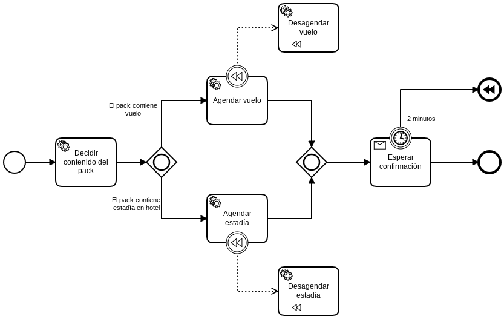

# Turismo 3

## Documentación

[External Tasks](https://docs.camunda.org/manual/7.9/user-guide/process-engine/external-tasks/)

Cómo iniciar un proceso desde el API [Link](https://docs.camunda.org/manual/7.9/reference/rest/process-definition/post-start-process-instance/)

Para iniciar el proceso es necesario hacer una llamada al endpoint http://localhost:8080/engine-rest/process-definition/key/PackTuristico/start

|   Nr. | Tópico                                        | Actividad                                                                                                                                                                                                                                                                                                                                                                                                                                                                                                                     |
| :---: | :---                                          | :---                                                                                                                                                                                                                                                                                                                                                                                                                                                                                                                          |
|     1 | **'Decidir contenido del pack' Service Task** | 1. Configura el parámetro 'Implementation' = 'External'.   Configura el parámetro 'Topic' = 'DecidirTipoPack'.                                                                                                                                                                                                                                                                                                                                                                                                          |
|     2 | **'Agendar vuelo' Service Task** | 1. Configura el parámetro 'Implementation' = 'External'.   Configura el parámetro 'Topic' = 'AgendarVuelo'.                                                                                                                                                                                                                                                                                                                                                                                              |
|     3 | **'Agendar estadía' Service Task** | 1. Configura el parámetro 'Implementation' = 'External'.   Configura el parámetro 'Topic' = 'AgendarEstadia'.                                                                                                                                                                                                                                                                                                                                                                                           |
|     4 | **'El pack contiene vuelo?' flujo** | 1. Configura el parámetro 'Condition Type' = 'Expression' y 'Expression' = '${contieneVuelo}'.                                                                                                                                                                                                                                                                                                                                                                                                                 |
|     5 | **'El pack contiene estadía en hotel?' flujo** | 1. Configura el parámetro 'Condition Type' = 'Expression' y 'Expression' = '${contieneHotel}'.                                                                                                                                                                                                                                                                                                                                                                                                            |
|     6 | **'Esperar confirmación' Receive Task** | 1. Configura el parámetro 'Message' = 'Confirmación'.   Configura el parámetro 'Message Name' = 'Confirmacion'.                                                                                                                                                                                                                                                                                                                                                |
|     7 | **'2 minutos' Timer Boundary Event Task** | 1. Configura el parámetro 'Timer Definition Type' = 'Duration'.   Configura el parámetro 'Timer Definition' = 'PT2M'.                                                                                                                                                                                                                                                                                              |
|     8 | **'Desagendar vuelo' Service Task** | 1. Configura el parámetro 'Implementation' = 'External'.   Configura el parámetro 'Topic' = 'DesagendarVuelo'.                                                                                                                                                                                                                                                                                                                                                                                           |
|     9 | **'Desagendar estadía' Service Task**  | 1. Configura el parámetro 'Implementation' = 'External'.   Configura el parámetro 'Topic' = 'DesagendarEstadia'.                                                                                                                                                                                                                                                                                                                                                                                        |
