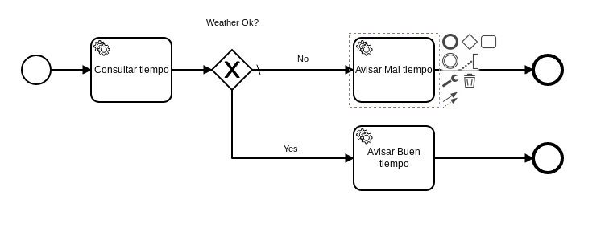

# Send email Example

|   Nr. | Topic              | Activity                                                                                                                                                                                                                                                                                                                                                                                                                                                                                                                                                                                                                                                                                                                                                                                                                                                                                                                                                                                                                                                                                                                                                                                                                                                                                                                                                                                                                                                                                    |
| :---: | :---               | :---                                                                                                                                                                                                                                                                                                                                                                                                                                                                                                                                                                                                                                                                                                                                                                                                                                                                                                                                                                                                                                                                                                                                                                                                                                                                                                                                                                                                                                                                                        |
|     1 | Model              | 1. Open camunda-modeler.   2. Draw the BPMN diagram.   3. **Start Event**: Add a form with a 'cityName' and 'correo' fields of type 'string' and a validation of name 'required' for both.   4. **'Consultar tiempo' Service Task**: Set the field 'Implementation' = 'Connector'.   5. **'Consultar tiempo' Service Task**: Switch to the **Connector** tab. Set the **Connector Id** = 'http-connector'.  6. **'Consultar tiempo' Service Task**: Add the following **Input Parameters**:  6a. **Name** = 'method'. **Type** = 'Text'. **Value** = 'GET'.   6b. **Name** = 'url'. **Type** = 'Script'. **Script Format** = 'freemarker'. **Script Type** = 'Inline Script'. **Script** = 'http://178.62.33.94:8000/weatherOk/${cityName}'.  7. **'Avisar buen tiempo' Service Task**: Set the field 'Implementation' = 'Connector'.   8. **'Avisar buen tiempo' Service Task**: Switch to the **Connector** tab. Set the **Connector Id** = 'mail-send'.  9. **'Avisar buen tiempo' Service Task**: Add the following **Input Parameters**:  9a. **Name** = 'to'. **Type** = 'Text'. **Value** = '#{correo}'.   9b. **Name** = 'subject'. **Type** = 'Text'. **Value** = 'Weather'.   9c. **Name** = 'text'. **Type** = 'Text'. **Value** = 'El tiempo está bueno en #{cityName}.'.   10. **'Avisar mal tiempo' Service Task**: Set the field 'Implementation' = 'Connector'.   11. **'Avisar mal tiempo' Service Task**: Switch to the **Connector** tab. Set the **Connector Id** = 'mail-send'.  12. **'Avisar mal tiempo' Service Task**: Add the following **Input Parameters**:  12a. **Name** = 'to'. **Type** = 'Text'. **Value** = '#{correo}'.   12b. **Name** = 'subject'. **Type** = 'Text'. **Value** = 'Weather'.   12c. **Name** = 'text'. **Type** = 'Text'. **Value** = 'El tiempo está malo en #{cityName}.'.   13. **'Weather ok? Yes' Sequence Flow**: Set the field 'Condition Type' = 'Expression' and 'Expression' = '#{weatherOk}'.   14. **'Weather ok? No' Sequence Flow**: Using the tool icon change its type to a 'Default Flow'.    |
