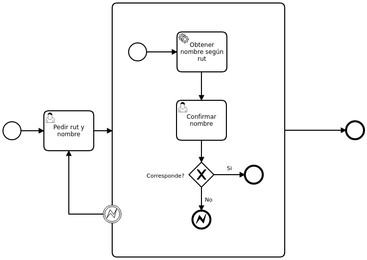

# Check Rut Example



|   Nr. | Topic              | Activity                                                                                                                                                                                                                                                                                                                                                                                                                                                                                                                                                                                                                                                                                                                                                                                                                                                                                                                                                                                                                                                                                                                                                                                                                                                                                                                                                                                                                                                                                    |
| :---: | :---               | :---                                                                                                                                                                                                                                                                                                                                                                                                                                                                                                                                                                                                                                                                                                                                                                                                                                                                                                                                                                                                                                                                                                                                                                                                                                                                                                                                                                                                                                                                                        |
|     1 | Create the project | 1. In Eclipse go to 'New --> Project --> Maven Project' and select 'Maven --> camunda-archetype-servlet-war'.  <br> 2. In Group Id: 'com.camunda.demo' in ArtifactId: 'CheckRut'                                                                                                                                                                                                                                                                                                                                                                                                                                                                                                                                                                                                                                                                                                                                                                                                                                                                                                                                                                                                                                                                                                                                                                                                                                                                                                |
|     2 | Configure Eclipse  | 1. Add the following code in the line 142 of the 'pom.xml' file: <br> ``` <dependency> <groupId>org.camunda.connect</groupId> <artifactId>camunda-connect-http-client</artifactId> </dependency> <dependency> <groupId>org.camunda.bpm</groupId> <artifactId>camunda-engine-plugin-connect</artifactId> </dependency> ``` <br> 2. Add the following code in the line 15 of the 'src/test/resources' file: <br> ``` <bean class="org.camunda.connect.plugin.impl.ConnectProcessEnginePlugin" /> ``` |
|     3 | Model              | 1. Open 'src/main/resources/process.bpmn' in camunda-modeler. <br> 2. Draw the BPMN diagram. <br> 3. **'Pedir rut y nombre' User Task**: Add a form with a 'name' field of type 'string' and a 'rut' field of type 'string'. <br> 4. **'Confirmar nombre' User Task**: Add a form with a 'name' field of type 'string', a 'retrievedName' field of type 'string' and a 'match' field of type 'boolean'. <br> 5. **'Obtener nombre según rut' Service Task**: Set the field 'Implementation' = 'Connector'. <br> 6. **'Obtener nombre según rut' Service Task**: Switch to the **Connector** tab. Set the **Connector Id** = 'http-connector'.<br> 7. **'Obtener nombre según rut' Service Task**: Add the following **Input Parameters**:<br> 7a. **Name** = 'method'. **Type** = 'Text'. **Value** = 'GET'. <br> 7b. **Name** = 'url'. **Type** = 'Script'. **Script Format** = 'freemarker'. **Script Type** = 'Inline Script'. **Script** = 'https://api.rutify.cl/rut/${rut}'.<br> 8. **'Obtener nombre según rut' Service Task**: Add the following **Output Parameters**: <br> 8a. **Name** = 'retrievedName'. **Type** = 'Script'. **Script Format** = 'javaScript'. **Script Type** = 'Inline Script'. **Script** = 'S(response).prop("nombre").value().toString()' <br> 9. **'Corresponde? Si' Sequence Flow**: Set the field 'Condition Type' = 'Expression' and 'Expression' = '#{match}'. <br> 10. **'Corresponde? No' Sequence Flow**: Using the tool icon change its type to a 'Default Flow'. <br>  11. **Error Termination Event**: Create a new Error with **Error Name** = 'Nombre no corresponde' and **Error Code** = 'Nombre no corresponde'. <br> 12. **Error Intermediate Event**: Select the 'Nombre no corresponde' error from the dropdown. |
