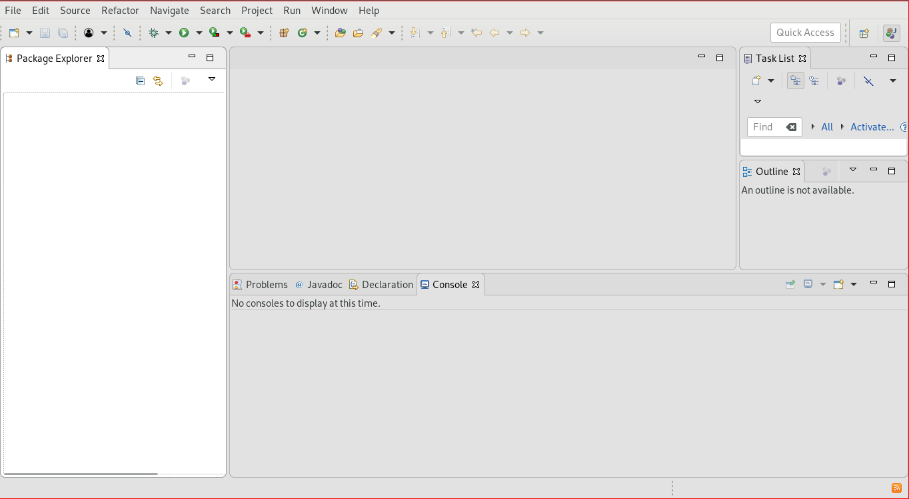
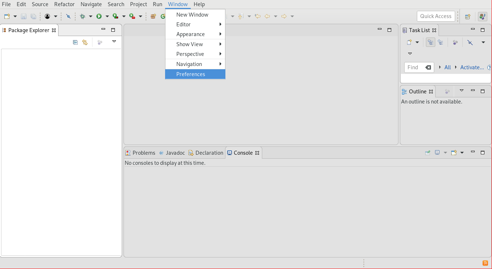
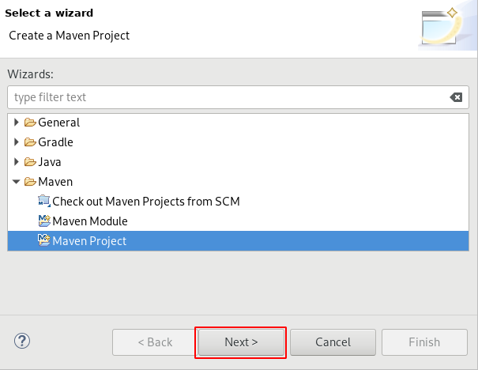
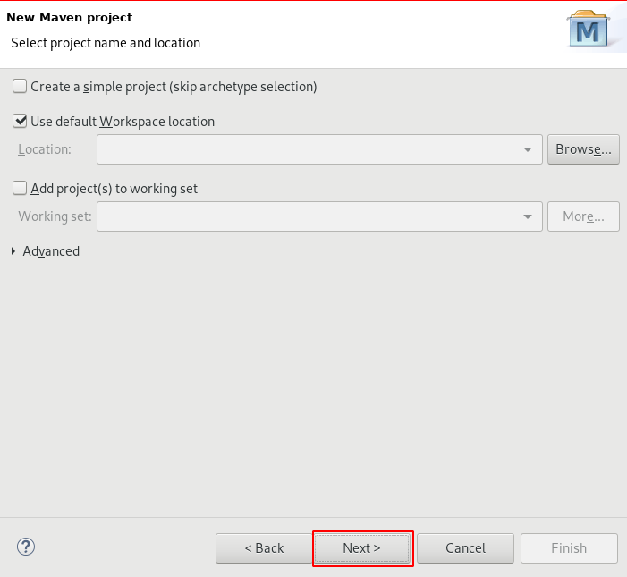
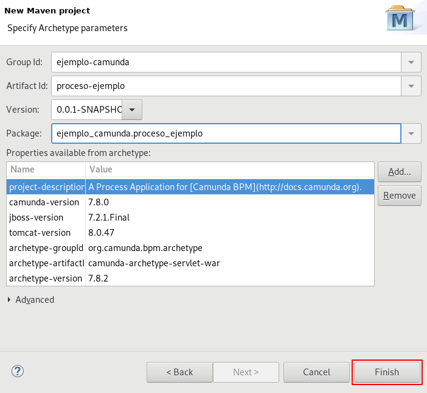
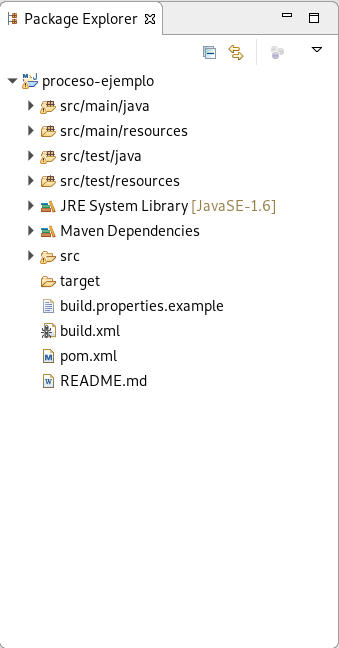

# Descargar configuración de Camunda

Se abre el menú **Windows** $\Rightarrow$ **Preferences**.

\newpage

En el diálogo seleccionar **Maven** $\Rightarrow$ **Archetypes**.

Luego presionar el botón **Add Remote Catalog**.

\newpage

Rellenar los campos con la siguiente información

- **Catalog File**: https://app.camunda.com/nexus/content/repositories/camunda-bpm/
- **Name**: Camunda

Presionar el botón **OK**.

\newpage

Presionar el botón **Apply and Close**.

\newpage
# Crear el proyecto

Abrir el menú **File** $\Rightarrow$ **New** $\Rightarrow$ **Project...**

\newpage

Seleccionar la opción **Maven** $\Rightarrow$ **Maven Project**.

Luego presionar **Next>** dos veces.

\newpage

Elegir el *arquetipo* correcto:

| camunda-archetype-servlet-war

Presionar **Next>**.

\newpage

Rellenar los datos del proyecto.

- **Group Id**: Organizacion.
- **Artifact Id**: Nombre del proyecto.

Presionar **Finish**.

\newpage

El proyecto ha sido creado exitósamente.

