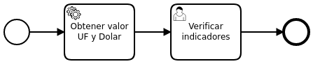
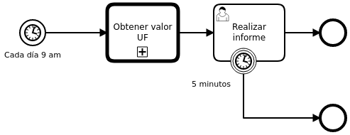
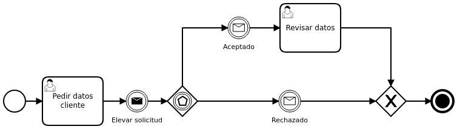
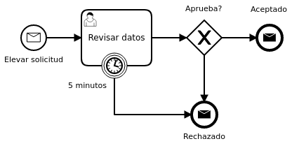

# Exercice 1

### User Task: Verificar indicadores

| nr. | field | type   |
|-----|-------|--------|
|   1 | uf    | String |
|   2 | dolar | String |

### Service Task: Obtener valor UF y Dolar

Connects to the API and retrieves 2 values: "uf" and "dolar".

API url: [http://indicadoresdeldia.cl/webservice/indicadores.json](http://indicadoresdeldia.cl/webservice/indicadores.json)

# Exercice 2

### User Task: Realizar informe

| nr. | field  | type   |
|-----|--------|--------|
|   1 | uf     | String |
|   2 | report | String |

### Service Task: Obtener valor UF

Should call the process from Exercice 1.

### Timer Start Event

Should fire every weekday (Mon-Fri) at 9 AM.

### Intermediate Timer Throw Event

Should fire after 5 minutes.

# Exercice 3

Every send event should communicate with the receive event of the same name and
transfer the information required by the User Tasks.

## Solicitud

### User Task: Pedir datos cliente

| nr. | field     | type   |
|-----|-----------|--------|
|   1 | firstname | String |
|   2 | lastname  | String |
|   3 | addres    | String |
|   4 | age       | Long   |

### User Task: Revisar datos

| nr. | field     | type    |
|-----|-----------|---------|
|   1 | firstname | String  |
|   2 | lastname  | String  |
|   5 | accepts   | Boolean |

## Revisar Solicitud

### User Task: Revisar datos

| nr. | field     | type    |
|-----|-----------|---------|
|   1 | firstname | String  |
|   2 | lastname  | String  |
|   3 | addres    | String  |
|   4 | age       | Long    |
|   5 | accepts   | Boolean |

### Intermediate Timer Throw Event

Should fire after 5 minutes.
